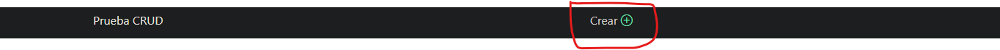

# Manual Técnico

## Introducción

Aplicación web que realiza operaciones CRUD (Create, Read, Update y Delete), desarrollada con Framework Slim (PHP) para la creación de un API que realizara las operaciones CRUD para la parte del Back-end, HTLM, CSS (Bootstrap) y javaScript (uso de librería axios para peticiones HTTP), para la parte del Front-end y para la parte de bases de datos el gestor de bases de datos MySQL.

La aplicación web funciona mediante peticiones HTTP a un API que se encargara de realizar las operaciones CRUD a una base de datos MySQL mediante el lenguaje PHP y con ayuda de JavaScript con la librería axios que hace las solicitudes get, post, put y delete desde la interfaz de usuario.

## Objetivo

El objetivo principal de esta aplicación es la realización de las operaciones CRUD a una base de datos desde la web, con apoyo de algún framework de cualquier lenguaje de programación que en esta ocasión se decidió trabajar con PHP para la parte del Back-en  y JavaScript para el Fron-end.

## Guia de uso

En este apartado se explicara de manera detallada el funcionamiento de la aplicación web.

**Pantalla de inicio**

Muestra una tabla con los datos ingresados en la base de datos

**Agregar nuevos datos**

Haciendo clic sobre el botón verde de la parte superior se abrirá un formulario en el cual se deberán agregar los datos que deseamos ingresar a la base de datos

Formulario 

**Actualizar datos**

Para actualizar algún dato basta con dar clic sobre el botón azul de la fila donde se encuentre el registro que se modificara, se abrirá un formulario con los datos del registro, posteriormente ingresar los nuevos datos que queremos actualizar.

Formulario actualizar

**Eliminar registro**

Para eliminar un registro de la base de datos bastara con hacer clic sobre el botón rojo de la fila del registro que deseamos eliminar y confirmar si queremos eliminar el registro.

Pantalla de confirmación

- - -
- - -

# Implementación

Para implementar este proyecto en cualquier entorno de desarrollo o producción y que funcione correctamente sera necesario contar con los siguientes elementos: 

- PHP versión 7.0 o superior
- Gestor de base de datos MySQL
- Servidor apache

Configuración de la base de datos
Crear una base de dato sen MySQL y dentro crear una tabla llamada usuario con las columnas idusuario, nombre, correo y nombre usuario.

~~~
 CREATE TABLE `usuario` (
  `idusuario` int(11) NOT NULL AUTO_INCREMENT,
  `Nombre` varchar(100) NOT NULL,
  `Correo` varchar(100) NOT NULL,
  `Nombre_usuario` varchar(100) NOT NULL
)
~~~

Una vez creada la base de datos se deberá configurar el archivo db.php cubicado en la ruta API/src/config/db.php cambiando los parámetros de conexión por los que hemos generado en la nueva base de datos 

~~~
 <?php
    class db{
        private $host = "jhdjjtqo9w5bzq2t.cbetxkdyhwsb.us-east-1.rds.amazonaws.com";
        private $user = "r5yt7vt1w4l3a33z";
        private $password = "gphmkg044hcp3gcc";
        private $database = "us80dn4domphm56j";

        public function conexionDB(){
            $connect = "mysql:dbname=$this->database;host=$this->host";
            $dbConexion = new PDO($connect, $this->user, $this->password);
            $dbConexion->setAttribute(PDO::ATTR_ERRMODE, PDO::ERRMODE_EXCEPTION);
            return $dbConexion;
        }
    }

~~~

por último en el archivo datos.js ubicado en docs/js/datos.js bastara con colocar el nombre de dominio para comunicación con el API, para poder realizar las peticiones HTTP.

listo esa sera la configuración necesaria para poner en marcha este pequeño proyecto.
